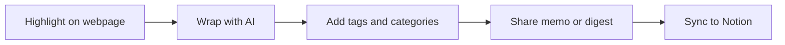

# AI Memo Wrap

<p align="center">
  AI-native Chrome extension for capturing highlights, wrapping them into memos/tasks, tagging, sharing, and syncing to Notion.
  <br />
  Also works as a workflow-safe scratchpad when embedded AI chats get reset in other tools.
</p>

<p align="center">
  <a href="https://zoezyzy.github.io/AI-Memo-Wrap-Intro/">Home</a> ·
  <a href="https://zoezyzy.github.io/AI-Memo-Wrap-Intro/features.html">Features</a> ·
  <a href="https://zoezyzy.github.io/AI-Memo-Wrap-Intro/demo.html">H5 Demo</a> ·
  <a href="https://chromewebstore.google.com/detail/ai-memo-wrap/hlmadcmleiholmlengnlodmfobdbmdac">Install</a>
</p>

## Why AI Memo Wrap

- Capture knowledge directly where you read
- Transform snippets into structured memo/task outputs
- Organize by categories and tags (`#tag` filters)
- Share single memo or digest outputs quickly
- Sync to Notion with a stable workflow
- Keep draft context while switching between AI chat and form editors

## Real-World Workflow: Shopify Flow Email Editing

EN:
- In tools like Shopify Flow, editing an email block can close/reset the built-in AI chat panel.
- AI Memo Wrap acts as a side scratchpad so you can keep key AI suggestions.
- You can selectively copy snippets into different email sections (subject, body blocks, CTA, footer) without losing context.

中文:
- 在 Shopify Flow 这类工具中，编辑邮件区块时常会导致内置 AI 对话窗口被关闭或重置。
- AI Memo Wrap 可以作为侧边“随记缓冲区”，先保存 AI 给出的关键内容。
- 你可以再按需把不同片段复制回邮件的不同区域（标题、正文、CTA、页脚），不中断工作流。

## Visual Workflow



## Feature Coverage

| Module | What it does |
|---|---|
| Flash Panel | Inline `Wrap ✨` capture from selected text |
| Side Panel | Memo list, filters, detail drawer, bulk actions |
| Memo Tags | Up to 10 tags per memo, max 24 chars each |
| Tag Filter | Search + `#tag` query + removable active chips |
| Workflow Continuity Buffer | Preserve AI suggestions while editing forms that reset embedded chat UIs |
| Sharing | Copy / share memo and digest output |
| Notion Sync | OAuth + cloud endpoint based sync |
| Cloud Sync (Optional) | Cross-device after login |
| Local-first Storage | Default `chrome.storage.local` mode |

## UI Component Preview

Open the visual component demo:

- [H5 Demo Page](./demo.html)

Demo contains:

- Flash capture widget
- Side panel memo cards
- Tag chips and filter bar
- Detail drawer preview
- Export/share action area

## Quick Start (Dev)

1. Install dependencies

```bash
npm install
```

2. Run UI preview

```bash
npm run dev
```

3. Build extension

```bash
npm run build:extension
```

4. Load unpacked extension

- Open `chrome://extensions`
- Enable `Developer mode`
- Click `Load unpacked`
- Select `dist-extension/`

## Tech Stack

- Chrome Extension Manifest V3
- React + TypeScript + Vite
- Tailwind CSS
- Supabase (Auth + Postgres + Edge Functions)
- Notion API

## Privacy & Security

- Local-first by default
- Cloud sync is opt-in
- Do not commit secrets
- Keep `.env.local` private
- Rotate tokens immediately if exposed

## Support

- Buy Me a Coffee: https://buymeacoffee.com/ZYZConsulting

## License

This project is currently **Proprietary / All Rights Reserved**.
See [LICENSE](./LICENSE).
