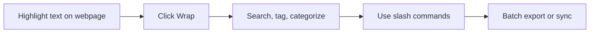

# AI Memo Wrap

<p align="center">
  AI web clipper for turning webpage highlights into searchable notes, tags, tasks, research sessions, exports, and optional Notion/cloud sync.
</p>

<p align="center">
  <a href="#english">English</a> ·
  <a href="#中文">中文</a>
</p>

<p align="center">
  <a href="https://zoezyzy.github.io/AI-Memo-Wrap-Intro/">Home</a> ·
  <a href="https://zoezyzy.github.io/AI-Memo-Wrap-Intro/features.html">Features</a> ·
  <a href="https://zoezyzy.github.io/AI-Memo-Wrap-Intro/demo.html">H5 Demo</a> ·
  <a href="https://chromewebstore.google.com/detail/ai-memo-wrap/hlmadcmleiholmlengnlodmfobdbmdac">Install</a>
</p>

## English

AI Memo Wrap is a Chrome extension for knowledge workers, researchers, students, creators, and operators who constantly collect useful fragments from the web.

Instead of copying quotes into scattered documents or losing tabs in browser history, highlight text on any webpage, click **Wrap**, and save it into a searchable side-panel memo library.

### What's New in v1.2.7

- Slash command search: type `/` in the side-panel search box to open quick actions
- Faster workflows for new manual memos, task filtering, batch selection, export, settings, calendar, kit manager, and refresh
- Improved floating capture bubble actions
- Clearer cloud sync wording: upload local memos or download cloud memos
- More stable content-script behavior after extension reloads
- Cleaner Chrome Web Store package and reduced redundant host permissions

### Core Features

- Highlight useful text on any webpage and save it with one click
- Keep source URL, page title, timestamp, category, tags, and session context
- Search by full text, `#tag`, category, session, starred, archived, or task status
- Type `/` in search to open a command menu for common actions
- Turn captured notes into tasks with deadlines
- Batch select current results and export/share them as reusable digests
- Export CSV or copy rich content blocks
- Optional Notion sync
- Optional account-based cloud sync across browsers/devices
- Local-first storage and privacy mode for sensitive browsing

### Visual Workflow



### Quick Start

1. Install AI Memo Wrap from the Chrome Web Store.
2. Open any webpage and select useful text.
3. Click the floating **Wrap ✨** bubble.
4. Open the side panel to search, tag, organize, export, or sync.
5. Type `/` in the search box to access quick commands.

### Development

```bash
npm install
npm run dev
npm run build:extension
```

Load the built extension from `dist-extension/` in `chrome://extensions`.

## 中文

AI Memo Wrap 是一个 Chrome 插件，适合研究、学习、内容创作、产品分析和日常知识管理场景。

你可以在任意网页高亮文字，点击 **Wrap**，把有价值的片段保存到侧边栏里的可搜索备忘库，而不是分散复制到多个文档或收藏夹。

### v1.2.7 新增亮点

- 在侧边栏搜索框输入 `/`，打开快捷命令菜单
- 可快速新建手动备忘、筛选任务、批量选择、导出、进入设置/日历/Kit Manager、刷新备忘
- 优化划词气泡和右侧更多操作
- 云同步文案更清晰：上传本地备忘或下载云端备忘
- 提升插件刷新后的稳定性
- 清理 Chrome Web Store 上传包并减少冗余权限

### 核心功能

- 在任意网页高亮文字，一键保存
- 自动保留来源链接、网页标题、时间、分类、标签和会话信息
- 支持全文搜索、`#标签`、分类、会话、星标、归档和任务筛选
- 搜索框输入 `/` 打开快捷命令
- 将捕获内容转成带截止日期的任务
- 批量选择当前筛选结果并导出/分享摘要
- 导出 CSV 或复制富文本内容块
- 可选同步到 Notion
- 可选账号云同步，跨浏览器/设备使用
- 默认本地存储，并支持隐私模式

### 支持

- Website: https://zoezyzy.github.io/AI-Memo-Wrap-Intro/
- Chrome Web Store: https://chromewebstore.google.com/detail/ai-memo-wrap/hlmadcmleiholmlengnlodmfobdbmdac
- Buy Me a Coffee: https://buymeacoffee.com/ZYZConsulting

## Privacy & Security

- Local-first by default
- Cloud sync is opt-in
- Notion sync is user-authorized
- Do not commit secrets or `.env.local`
- Rotate tokens immediately if exposed

## License

This project is currently **Proprietary / All Rights Reserved**.
